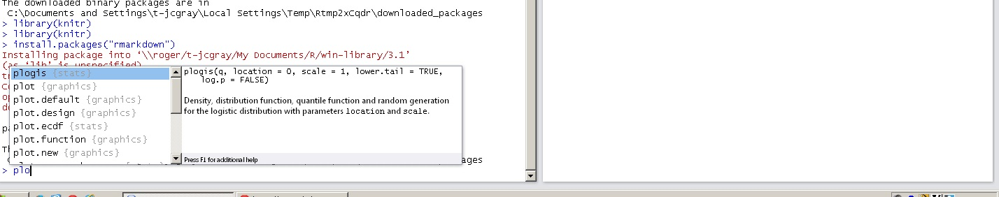

4.1 Intro
========================================================

Welcome to the first R lab!

R is a program that has been growing in popularity since its inception at University of Auckland in 1993.

It is a programming language in its own right, but widely used as a stats program by researchers.

R has become a strong tool in reproducible research - much of scientific computing is carried out by self taught programmers, and as such was often terrible quality and hard to run if you didnt write it. Think of the changes you make to an excel spreadsheet - you can describe them, but for someone trying to reproduce your steps somewhere else, it can be very hit or miss. Now think of code someone else wrote based on their exact computer, program versions and manual file changes. Not easy!

This is where R comes in. We can go from raw data to final plots in the program, and make it repeatable by simple copy paste. We can also share code as "packages" to allow other people acess to useful functions.

One of R's greatest virtues is that it is free and open source. You don't have to pay for an expensive license, and anyone can see and modify the code.

Every course you take in the EEB department now has the goal of using R. It is also heavily used by researchers in the department (Jeremy spends ~50% of his time working in R). R is used by companies as diverse as Google, Ebay, Amgen, Genentech and Fivethirtyeight.com.

We are going to use RStudio - a nicer UI to R (technically an IDE). This is also free!

This document was written in knitr - a way of making a shareable, repeatable document with embedded code. This is a markdown language (some of you may be familiar with Latex)


4.2 Instructions
========================================================

Normal instructions, etc are written in the below type face. You should type these into the command prompt

```{r}
#r input is written like this
```

```{r echo=FALSE}
print("r output is like this")
```

In this lab, we are going to familiarise ourselves with some of R's basic syntax, load in our data, and do a couple of basic plots.

First, let's open Rstudio. It is in under start>statistics apps>Rstudio

It should look a little like this:


Type/paste the commands into the console.


4.3 Basic Calculations and Operations
========================================================

First, let's do a little math

```{r eval=FALSE}
9*3
```

It will work like a calculator.

We can do a lot more:

```{r eval=FALSE}
(9*3)+log(sqrt(pi))*integrate(dnorm, -1.96, 1.96)[[1]]
```

Multiple lines are to be input line by line. The program knows when to end and start new lines based on bracketing.

As it is a programming language, we can assign results to an object using the `<-` operator. The left side is now "assigned" to be the output of the rightside

Watch the Environment pane as you enter the below in line by line:

```{r eval=FALSE}
secondsperminute<-60
minutesperhour<-60
hoursperday<-24
secondsperday<-secondsperminute*minutesperhour*hoursperday
secondsperday
```

The variables assigned to objects can be nearly anything - a discussion of different of R data types is too much for today, but have a look below and see if you can figure out what is going on:

```{r eval=FALSE}
x<-9
a<-c(1,2,3,4,5,6,7)
x*a
(z<-data.frame(1, 1:10, sample(c("a","b","d"), 10, replace = TRUE)))
(y<-"a big red dog")
(b<-as.matrix(1:10))
```

4.4 R as a functional language
========================================================

R depends heavily on functions. We use functions to give us interesting outputs based on our inputs.

functions normally look like function(x,y,z) where the x,y and z are arguments to the functions. The arguments can be numbers, lists, variables - nearly anything. Function outputs can be stored to objects, and objects can be function inputs

Try the below commands (one by one):

```{r eval=FALSE}
a=c(1,2,3,4,5)
mean(a)
sd(a)
(z<-runif(1))
log(z)
plot(cars)
```


We can also define our own functions, if we find we are doing the same long calculation multiple times. Here's a (very) simple example (note, this is not line by line, as R waits for the closing braces):

```{r}
sumtwo<-function(a,b){
  a+b
}
```

now we can call it:

```{r,eval=FALSE}
(a<-sumtwo(1,3))
(b<-sumtwo(100,500))
sumtwo(a,b)
```

Built in functions will often look like our simple example above, only more complicated based on their task. 


4.5 Help
========================================================

There are a lot of functions included in R. If you don't know how to use one, type in ?function

```{r eval=FALSE}
?runif
?exp
?plot
```

A lot of this help file won't make sense for now, but we can see it is a start on getting help. If you are stuck, opening the help page for the function and reading it (RTM) is a good first step. 

If you forget a function name or inputs in RStudio, you can hit Tab, and you will get hints of what to continue onto.

try typing plo, then hitting tab:



You will get a list of everything you can do that starts with plo... There is a lot!


4.6 Inputting Data
========================================================

Now that we know (a little) about functions and variables, let's read our data in!
First, let's download our data from blackboard.

It is called "height data2015.xlsx" in the lab assignments folder.

Download it to your downloads folder, and open it up in excel:


We want to change the format! .xslx is a propritry excel format - data should be free!

let's save it as a .csv, and remove the space in the filename:


click yes - we don't care about losing excel specific formatting

Close excel! Now we can open our file with whatever we want. Let's try a text editor:


We can see it is a simple text representation of our data with commas seperating the values and line breaks the rows. .csv stands for comma separated values.

Now we need to make sure R can open it up.
First let's check where we are in R:

```{r eval=FALSE}
getwd()
```

This should give you "\\\\roger/YOURUSERNAME/My Documents".
If not, please see a TA!

Lets change our working directory to our downloads folder

```{r eval=FALSE}
setwd("downloads")
dir()
```

```{r eval=FALSE}
read.csv("heightdata2015.csv")
```

so we printed it out, but lets assign it to a variable so we can access it:

```{r eval=FALSE}
soildata<-read.csv("heightdata2015.csv")
```


4.7 Exploratory Analysis
========================================================

What can we do now? Let's see what the data looks like (aka exploratory analysis)

```{r eval=FALSE}
head(soildata)
tail(soildata)
soildata$Height
mean(soildata$Height)
str(soildata)
```

The head and tail commands give us the first (or last) 6 rows of our data. The $ operator takes all the values from the named column, which we can then go on to mean.

The str function tells us what type our data is: a dataframe, with three factors (ie categorical variables), and a numeric column (our continuous response variable). If you continue on in R you will learn what this all means, and how to change it.

Recall our schema - what tests would be sensible to run on this data?


4.8 Subsetting Data
========================================================

We can subset our data. The $ sign gives us a column. We can filter, by using a function with the  == operator or bracket subsetting


```{r eval=FALSE}
soildata$Height
soildata$section=="Tues_am"
subset(soildata,section=="Tues_am")
soildata[soildata$section=="Tues_am",]
```

The subset function uses the large TRUE/FALSE vector to subset our dataframe.

If you are still confused, try these:

```{r eval=FALSE}
subset(soildata,Treatment=="WC/FC")
subset(soildata,Height>10.0)
```

Try pulling our your groups data! (hint: groups are stored in the soildata$group column and need to be surrounded by "")

4.9 Plotting Data
========================================================

We can plot our data. R has some very nice built in graphing capabilities:

```{r eval=FALSE}
plot(soildata$Height~soildata$Treatment)
plot(soildata$Height~soildata$group)
plot(soildata$Height~soildata$section)
```

The nomenclature here tells R we are plotting soildata$Height as a repsonse (~) of the Treatment, group or section. 

4.10 Assessment
========================================================

The last thing you need to do is plot your own data as a response of treatments.
First, subset the data to only your own group:

```{r eval=FALSE}
mydata<-soildata[soildata$group=="YOUR GROUP",]
```

Now, lets plot it! You should be able to figure out how to do this based on the previous code, but please ask if you are having troubles.

Before you go, make sure a TA sees your final plot and marks you off!


R and R studio are free and open source software. For instructions on installing on your personal computer, please see: http://cran.rstudio.com/ and http://www.rstudio.com/products/rstudio/download/
