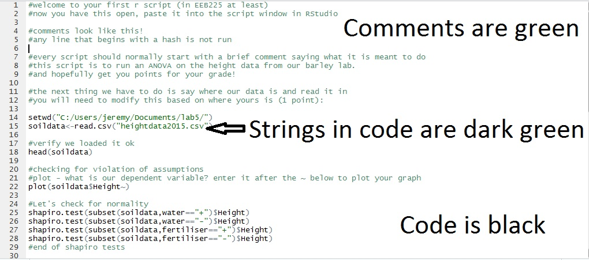
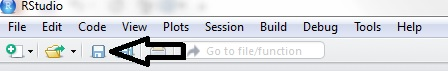
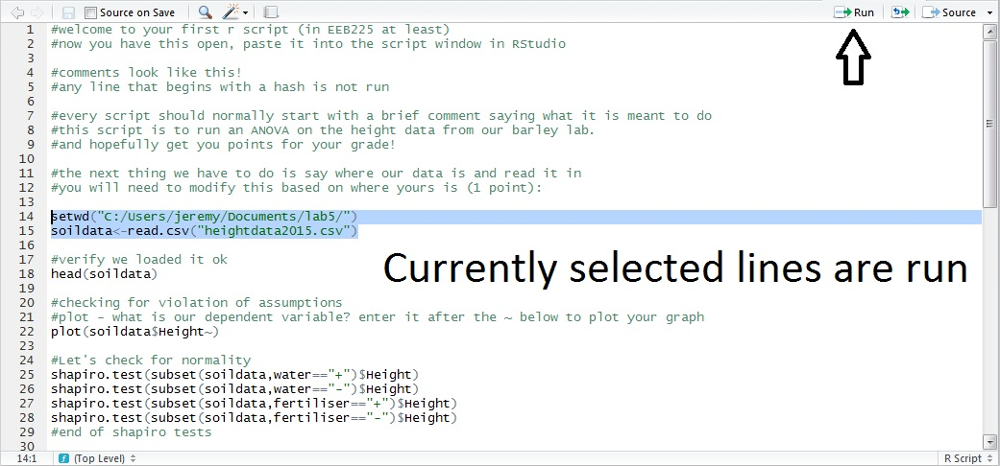

  
## 5.1 Intro

  
In this lab, we will run analysis using ANOVA on your *Hordeum vulgare* data from the previous labs. We are interested whether the growth rate of barley is influenced by the addition of water and/or fertilizer. 

One of the great advantages of R is we can make this analysis reproducible, using a "script", which we can then share with other researchers, or include as a supplementary data file in a published paper.

We will be modifying and using a script throughout this lab. The script contains most of the commands used already, but will need to be slightly modified based on your own setup, as well as filled in to run analyses where indicated. You will be assessed on both your script, and filling in the question sheet "Lab 5 Question Sheet" found on portal. Your final submission should be a filled out copy of the question sheet, and a copy of your script printed and stapled together.


## 5.2 Instructions


Open Rstudio (start>statistics apps>Rstudio)

In upper right, there is a small icon to start a new R script:


Press this, chhose R script and a new blank window will open above the console.

Go to blackboard, and download the file lab5script.txt - open it with a text editor and take a quick browse.
Now, copy the entire contents and paste it into the blank window above your console.

You will immediately notice that the script changes from colourless to coloured in several areas. This is RStudio parsing the text and finding functions, variables and comments in the script.



Next, save the script as a file. Hit the save icon above your script:



Then choose a filename that ends in .R (eg myanalysis.R) and save the file. Now we can start our work. Every time you modify the script, save it.

Download the .csv from portal. It is the same as last week, with recoded water and fertiliser columns.

To run a script (or part of it) select the part you want to run, and hit the run button



#### Changing directory

If you are running this on a home computer, or downloaded your data to a different place, you will need to know about working directories. In short, R is by default looking for files at some place on your computer. Find out where by typing:

```{r eval=FALSE}
getwd()
```

If you are trying to read a file, but it is not in the directory given above, you won't find it, and will get an error like this:

```{r error=TRUE}
read.csv("xyxyxyx.csv")
```

You can change working directory by typing in:

```{r eval=FALSE}
setwd("your/directory/structure")
```

RStudio also has a nice point and click interface - goto session>set working directory>choose directory and a box will pop up. Once you make your selection of directory, the relevant command will be entered in the console - save this and use in your script.

## 5.3 Running an ANOVA


Recall from lectures, we have 7 steps in running an ANOVA

1. Define question (should involve looking at a variable of interest in more than two groups)
2. Design your experiment, collect data
3. Test for violations of assumptions
4. Calculate ANOVA - output F statistic
5. Compare F to the F-distribution table using appropriate degrees of freedom
6. Report results and statistical significance
7. Infer answer to question

#### Step 1 - What is our statistical hypothesis? 

Fill out Question 1. **(0.5 points)**

#### Step 2 - This is what you did in your lab

#### Step 3 - We have multiple things to do here:

let's read our data in first: Lines 16 and 17 in our script have this code - you need to change it for your directory. Then save your script, select it and run it **(1 point)**.

To test the assumptions, we would like to plot the data as a first step. We are interested in our treatments resulting in some output - put the dependant variable into the script so our graph will plot **(1 point)**.

Our next test is for assumptions - Run the R commands for Shapiro and Bartlett tests. Recall a Shapiro test tests for normality of the data, and Bartlett for equal variances. How do we get help for these functions? Type it into the script **(1 point)**.

Fill out Question 2. What can we conclude from these tests? Should we be running an ANOVA? **(2 points)**

Now, let's assume that our data passed the above tests (it may not have!). We want to run an anova based on presence or absence of water, and one based on presence or absence of fertiliser.

Question 3. What statistical test is equivalent to these two tests? **(0.5 points)**

#### Steps 4-5 - Run the ANOVA

Let's run the ANOVAs - the one with water is written for you. Enter the command for the fertiliser analysis in the script **(1 point)**. R will automatically give us our p-values

#### Steps 6-7 - Report results

Enter the summary tables into the question sheet at Question 4 (you can copy paste from the console output). What can we conclude from the tests? **(2 points)**

## 5.3 Running a Two-Way/Factorial ANOVA

We can also test for interactions between our groups (you may not have covered this in lectures yet, see https://en.wikipedia.org/wiki/Two-way_analysis_of_variance). To do this, we can tell the ANOVA we are interested in two variables. Recall our previous formula:

```{r eval=FALSE}
soildata$Height~soildata$water
```

We can write this out as "Height is a repsonse of water". The R formula function can be used in a ton of ways:

```{r eval=FALSE}
?formula
```

We are interested in interaction between our water and fertiliser treatments, so our formula looks like this:

```{r eval=FALSE}
soildata$Height ~ soildata$water + soildata$fertiliser + soildata$fertiliser:soildata$water
```

which is equivalent to saying "Height is a repsonse of water, plus a response of fertiliser, plus an interaction of fertiliser and water"

Write your script to run this formula in an anova (and summary) **(1 point)** 

Question 5 - Paste in your summary table. What is your statistical conclusion from this test? **(1 point)**

Question 6 -  What are the overall biological conclusions for our analysis in both sections? **(2 points)**

## 5.4 Running your own analysis

Think a little bit about the data we have. We had a single hypothesis, and tested it using our data. Now, imagine you decide that you don't trust the other two lab streams (if you already didn't, good), and that they messed up their experiment. 

Your new hypothesis is that the height of plants might not just vary by treatment, but by lab section, and some interaction between these (note, for this section, use the "Treatment" variable, not water and fertiliser individually). Plot the heights as a reponse of lab section, and write a function to run a two way ANOVA in your script (you can assume the data is normal). **(2 points)** 

In the question sheet, include your hypothesis, statistical hypothesis, summary table, statistical conclusion and biological conclusion. **(6 points)**

## 5.5 Running your script

Now your script should contain enough code to repeat all the above analyses. You can run it all by selecting and running and if you wanted to you could automate it to run from the command line (This is a little advanced for this class, just know it is possible). Other than the directory you have chosen, your code should run on anyone elses computer!

If you have errors, unclosed brackets or other troubles try to work through the problem line by line. Too many closed brackets give the error "Error: unexpected ')' in ")"", while too many open brackets will give you a `+` at the console instead of a `>`. Try your best to trouble shoot any code you have, otherwise feel free to send an email (to Jeremy) or visit office hours.


## 5.6 Submission

Please print out your R script, as well as the question sheet with your answers in it. Both your script and your analysis should not exceed 4 pages total. This is due in your lab in the week of March 17/18.

