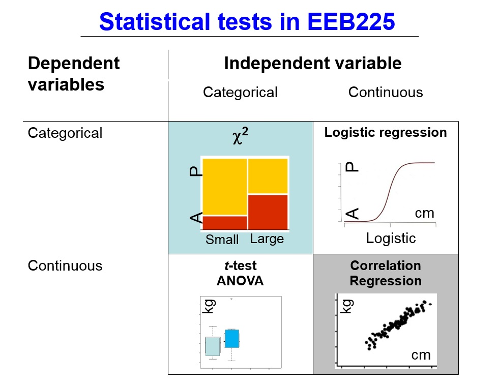
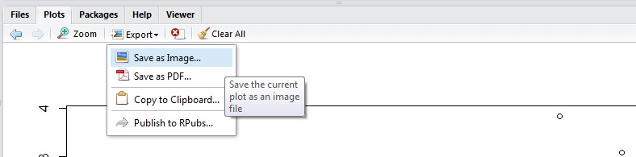

  
## 6.1 Intro

  
In this lab, we have two main objectives. The first is to learn linear regression and how to run it in R. The second is to learn how to install and load packages in R, as well as output images.

Unfortunately, we don't have data that is capable of being used for linear regression - Recall our schema:




However, I have simulated a "depth" variable for our *Hordeum vulgare* data. This represents the depth at which the seeds were initially planted. 

Again, please download the heightdata file and the testdata file from portal, as well as the question sheet.


## 6.2 Instructions

Open Rstudio and load in the testdata.csv file. Read it to an object named "testdata". this file is not the height data, it is simulated data to give you an idea of what to run. The real data is to be analysed for your report.


## 6.3 Advanced Plotting

When we have two continuous variables, the first thing to do is often to plot them against each other.

```{r,eval=FALSE}
plot(testdata$X~testdata$Y)
```

R will give us a reasonable looking plot, with default axis labels. This is ok for now, but what if we want to present our graph more formally?

Recall we can get help on a function by using the ?

```{r,eval=FALSE}
?plot
```

see if you can find the methods to add ylabels, xlabels and main titles - read the help file, or run the examples at the very bottom.

However, the base plotting capabilities in R are a little rudimentary. Several people have taken it upon themselves to fix this. Today we will use "ggplot2" created by Hadley Wickham, probably the most popular graphing package in R. 

Rs great use in science is that as well as its base capabilities, anyone can create a package which other people can then download and use. Curated packages end up on CRAN, and can be installed very easily in R. 

For example, all the data in your textbook is contained in the package "abd" and "ape" is used for analyses of phylogenetics and evolution. See a list of all available packages at http://cran.r-project.org/web/packages/available_packages_by_name.html

Let's install ggplot2. This only needs to be run once every time you install R.

```{r, eval=FALSE}
install.packages("ggplot2")
```

R will download and install the package, and any other packages it depends on. If you get an error, please see a TA.

Next, we need to tell R we want to load it, **this needs to be run every time R opens** and you want to use the functions in ggplot2:


```{r, eval=FALSE}
library(ggplot2)
```

ggplot is based on a "grammar of graphics" - for more details, see http://docs.ggplot2.org/current/

Let's try and plot our data: Here we have said our data is called testdata, and our "aesthetics" are X on the x, and Y on the y 

```{r, eval=FALSE}
ggplot(data=testdata, aes(x=X, y=Y))
```

Huh, nothing happened! Let's try again.

```{r, eval=FALSE}
ggplot(data=testdata, aes(x=X, y=Y))+geom_point()
```

This time we told ggplot that we want a "geom_point" graph. There are a myriad of other graph types, which make varying amounts of sense for our data. Try these:

```{r, eval=FALSE}
ggplot(data=testdata, aes(x=X, y=Y))+geom_bin2d()
ggplot(data=testdata, aes(x=X, y=Y))+geom_density2d()
ggplot(data=testdata, aes(x=X, y=Y))+geom_boxplot()
ggplot(data=testdata, aes(x=X, y=Y))+geom_polygon()
```

Depending on your data, you can make many types of ggplot graphs. The documentation linked above is full of them, also try typing in geom_ and hitting tab to see all possible graph types.

We can also easily add on titles:

```{r, eval=FALSE}
ggplot(data=testdata, aes(x=X, y=Y))+geom_point()+
  ggtitle("test data x vs y")+xlab("X (cm)")+ylab("Y (cm)")
```

To export a graph, we can use the export button in RStudio and save to disk or copy to clipboard.



You can also use the relevant command - pdf(),jpeg(),tiff(),png(), or many more 9this helps with reproducibility). Remember to turn off the device when you are done with dev.off()

```{r,eval=FALSE}
jpeg("plot01.jpg")
ggplot(data=testdata, aes(x=X, y=Y))+geom_point()+
  ggtitle("test data x vs y")+xlab("X (cm)")+ylab("Y (cm)")
dev.off()
```


You should have just made a .jpg in your working directory (with bad resolution, try ?jpeg to make it nicer).


## 6.4 Linear Regression

Linear regression is a way to quantify the dependence of one continuous variable on another (see https://en.wikipedia.org/wiki/Linear_regression if you haven't met these in lectures yet). We want to see what happens to a variable as we increase or decrease another variable - the Covariance.

To boil this down to simple math - we can model our variable of interest as a function:

$Y=\alpha + \beta * X$

Where y and x are our data $\alpha$ is our intercept and $\beta$ is our slope. We want to estimate the slope and intercept, so we can understand the relationship.

To do this, we can model the data in R. First, we runa correlation test:

```{r,eval=FALSE}
cor.test(testdata$X,testdata$Y)
```


Linear models rely on the data being normally distributed - how can we test this?

If our data are not normal, we can use the Spearman Rank correlation -

```{r,eval=FALSE}
cor.test(testdata$X,testdata$Y,method="spearman")
```

Now we can run a linear regression:

```{r eval=FALSE}
model1<-lm(testdata$X~testdata$Y)
summary(model1)
```

And plot it out with ggplot2. ggplot2 has the lm method embedded in the stat_smooth function.

```{r,eval=FALSE}
ggplot(data=testdata, aes(x=X, y=Y))+geom_point()+
  stat_smooth(method = "lm", col = "blue")
```

##Assignment

You now need to run this analysis, but on the provided soildata.csv file. I strongly recommend using a script as in lab 5, but this is not necessary for the assignment. Please see the question sheet for detailed instructions and mark breakdowns. This is due in in the last lecture on April 2.
